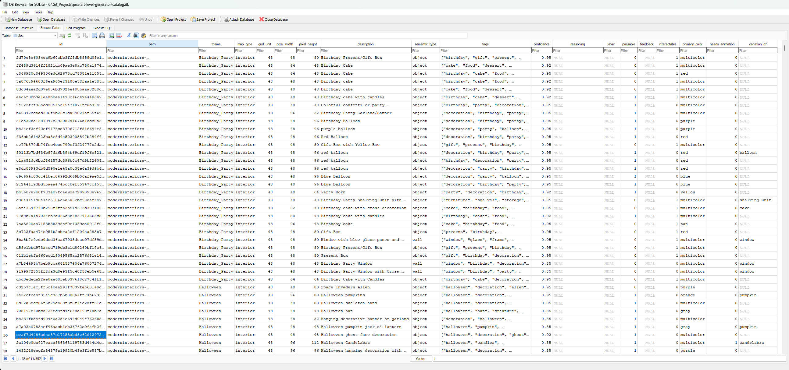

# spritedatabase

A Python package for cataloging pixel art tile assets and compositing them into map images.

## Motivation

This project started as an experiment using Claude AI as the central decision-making engine for a game engine. While the concept was promising, I quickly discovered that AI-generated maps using only prompts were visually inconsistent and often nonsensical — the model couldn't reliably translate descriptions into coherent level layouts.

The solution: rather than asking the AI to generate raw maps, **give it a curated database of real pixel art tiles to work with**. By indexing every tile with semantic metadata (what it is, what it's suitable for, placement rules), the AI can now compose maps from actual assets, resulting in much better visual coherence and gameplay quality.

This package handles the indexing: it scans your pixel art assets, runs them through a vision model (Ollama or Claude), builds a machine-queryable catalog, and provides a renderer to composite selected tiles into final map images. The game engine then uses this catalog to make informed placement decisions.

## What it does

`pixelart_map` indexes pixel art tile assets into a machine-queryable database, enabling LLM-driven game engines to automatically generate game maps without hardcoding asset paths or visual descriptions. The package has three responsibilities:

1. **Offline analyzer** — scans pixel art tile PNGs in `data/` using either a local Ollama vision model (Qwen2-VL) or Anthropic's Batch API, produces a `catalog.db` with semantic metadata (description, type, tags, confidence) for every tile
2. **Catalog API** — query interface over the catalog, allowing machine-to-machine searches by theme, map type, semantic type, or free-text keywords
3. **Renderer** — composites a list of tile placements into a PNG image using Pillow

**Use case:** Game engines can query the catalog for tiles matching LLM-generated descriptions ("a wooden door", "brown storage furniture") without needing to know filesystem paths or asset pack structure. This enables fully automated map generation workflows.

The package is consumed by a separate game engine that owns all LLM-based map generation, HTTP endpoints, and game state. This package has no HTTP server.

### Example workflow

1. **Index phase** (one-time setup):
   ```bash
   pixelart-analyze --data-dir ./data --backend claude
   ```
   Produces `catalog.db` with all tiles indexed by semantic properties.

2. **Generation phase** (at runtime):
   ```python
   from pixelart_map import get_catalog, render_map
   
   catalog = get_catalog()
   
   # LLM generates a list of tile descriptions for a bedroom
   tiles_needed = ["wooden bed", "nightstand", "rug", "window"]
   
   # Query catalog for matching tiles
   placements = []
   for description in tiles_needed:
       matches = catalog.search(description)
       if matches:
           placements.append({"x": ..., "y": ..., "tile_id": matches[0].id})
   
   # Render the composed map
   result = render_map(
       grid_width=15, grid_height=15, 
       placements=placements,
       data_dir="./data"
   )
   ```

This decouples asset discovery from asset paths, enabling fully automated game creation pipelines.

## Prerequisites

- Python ≥ 3.11
- Pixel art assets present at `PIXELART_DATA_DIR`
- **For `--backend ollama`** (default): Ollama running locally with `qwen2.5vl:7b` pulled
  ```bash
  ollama serve
  ollama pull qwen2.5vl:7b
  ```
- **For `--backend claude`**: Set `ANTHROPIC_API_KEY` environment variable with a valid Anthropic API key

## Installation

```bash
pip install git+https://github.com/jolsso/spritedatabase
```

For development:

```bash
git clone git@github.com:jolsso/spritedatabase.git
cd spritedatabase
pip install -e ".[dev]"
```

## Usage

### Build the catalog (offline, one-time)

Using **Ollama** (default, requires local GPU):
```bash
pixelart-analyze --data-dir ./data --output catalog.db
```

Using **Claude Batch API** (requires `ANTHROPIC_API_KEY`):
```bash
pixelart-analyze --data-dir ./data --output catalog.db --backend claude
```

Re-runs are incremental — already-analyzed tiles are skipped. Use `--limit N` to process only N new tiles:
```bash
pixelart-analyze --data-dir ./data --backend claude --limit 100
```

### Query the catalog

```python
from pixelart_map import get_catalog

catalog = get_catalog()

catalog.themes()                                 # -> List[str]
catalog.tiles_by_theme("Classroom_and_Library")  # -> List[TileInfo]
catalog.tiles_by_map_type("interior")            # -> List[TileInfo]
catalog.tiles_by_semantic_type("furniture")      # -> List[TileInfo]
catalog.search("desk")                           # -> List[TileInfo]
catalog.get_tile("<sha256-tile-id>")             # -> TileInfo
```

### Render a map

```python
from pixelart_map import render_map

result = render_map(
    grid_width=15,
    grid_height=15,
    placements=[
        {"x": 0, "y": 0, "tile_id": "<sha256>"},
        {"x": 1, "y": 0, "tile_id": "<sha256>"},
    ],
    data_dir="/path/to/data",
)

result.png_bytes  # PNG-encoded image as bytes
result.tilemap    # placements with resolved theme/semantic_type/dimensions
```

## Data Model

The analyzer builds a SQLite catalog (`catalog.db`) with detailed metadata for every tile. Each tile record is a `TileInfo` object containing:

> **Quality note:** Tile descriptions and confidence scores depend on the vision model used. Ollama (Qwen2.5-VL) provides good semantic classification but may miss fine details. Claude (Haiku) typically delivers higher accuracy and more detailed reasoning. Experiment with both backends to find the best fit for your use case.

| Field | Type | Purpose |
|---|---|---|
| `id` | str | SHA-256 hash of the tile's relative path; uniquely identifies the tile |
| `path` | str | Relative path to the PNG file (e.g., `moderninteriors-win/1_Interiors/...`) |
| `theme` | str | Normalized theme name (e.g., `Classroom_and_Library`) |
| `map_type` | str | Type of tile: `interior` or `exterior` |
| `grid_unit` | int | Tile grid size in pixels (e.g., 48) |
| `pixel_width` | int | Actual PNG width in pixels |
| `pixel_height` | int | Actual PNG height in pixels |
| `description` | str | AI-generated description of the tile (e.g., "Wooden door with brown frame") |
| `semantic_type` | str | Classification: `floor`, `wall`, `furniture`, `decoration`, `terrain`, `prop`, `building`, or `vehicle` |
| `tags` | list[str] | Keywords for search and filtering (e.g., `["door", "brown", "wood"]`) |
| `confidence` | float | 0.0–1.0 score indicating how confident the AI is in its classification |
| `reasoning` | str | *(Optional)* AI's explanation for its classification |
| `layer` | str | *(Optional)* Rendering layer hint (e.g., `foreground`, `background`) |
| `passable` | bool | *(Optional)* Whether a game character can walk through this tile |

### Catalog example

The committed `catalog.db` contains all indexed tiles. Here is an example view of the database:



### Example: Free Sample Tile

The repository includes `data/free_sample.png` as a reference example:


If analyzed, it would produce a record like:

```python
TileInfo(
    id="a1b2c3d4...",  # SHA-256 of "data/free_sample.png"
    path="data/free_sample.png",
    theme="free_sample",
    map_type="interior",
    grid_unit=48,
    pixel_width=48,
    pixel_height=48,
    description="Wooden closet with brown frame and small door window",
    semantic_type="furniture",
    tags=["closet", "brown", "wood", "storage", "cabinet"],
    confidence=0.88,
    reasoning="This is a game tile depicting an interior closet or cabinet structure. The brown wooden frame with a door and small window pane indicate it's a storage furniture piece suitable for interior locations.",
    layer="midground",
    passable=False,  # Characters cannot walk through a closet tile
)
```

**Note on output quality:** The accuracy and confidence scores depend on the vision model used:
- **Ollama (Qwen2.5-VL)**: Good for semantic classification, may struggle with fine details or ambiguous objects
- **Claude (Haiku)**: Better overall accuracy and reasoning quality, higher confidence scores

Run the same tile through different models to see how descriptions and confidence vary.

Query this tile from code:

```python
from pixelart_map import get_catalog

catalog = get_catalog()

# Find all furniture tiles
furniture = catalog.tiles_by_semantic_type("furniture")

# Search by keyword (tags are searchable)
closets = catalog.search("closet")
storage = catalog.search("storage")

# Get a specific tile by ID
tile = catalog.get_tile("a1b2c3d4...")
```

## Configuration

| Env var | Default | Purpose |
|---|---|---|
| `PIXELART_DATA_DIR` | *(required at render time)* | Root path of the asset folder |
| `PIXELART_CATALOG_PATH` | `catalog.db` next to package root | Override catalog location |
| `OLLAMA_HOST` | `http://localhost:11434` | Ollama server URL (for `--backend ollama`) |
| `OLLAMA_MODEL` | `qwen2.5vl:7b` | Vision model for tile analysis (for `--backend ollama`) |
| `ANTHROPIC_API_KEY` | *(required for `--backend claude`)* | Anthropic API key for Batch API |

## Running tests

No assets or GPU needed — all fixtures are generated programmatically.

```bash
pytest
```

## Asset setup

The pixel art assets are **not included** in this repository and must be purchased and set up manually:

1. Buy the asset packs from itch.io:
   - [Modern Interiors](https://limezu.itch.io/moderninteriors)
   - [Modern Exteriors](https://limezu.itch.io/modernexteriors)

2. Unzip both packages into the `data/` directory at the repo root:
   ```
   data/
   ├── moderninteriors-win/
   └── modernexteriors-win/
   ```

3. Run the analyzer to build `catalog.db`. Choose your backend:

   **Using Ollama** (default):
   ```bash
   pixelart-analyze --data-dir ./data --output catalog.db
   ```

   **Using Claude Batch API**:
   ```bash
   export ANTHROPIC_API_KEY="your-api-key-here"
   pixelart-analyze --data-dir ./data --output catalog.db --backend claude
   ```

## Asset credits

Pixel art assets by [LimeZu](https://limezu.itch.io/).

### Free Sample Tile License

The `data/free_sample.png` included in this repository is from LimeZu's free version and is subject to the following restrictions:

**You CAN:**
- Use the asset in non-commercial projects
- Edit the sprites and use them in non-commercial projects

**You CANNOT:**
- Use the asset in commercial projects
- Edit the sprites and use them in commercial projects
- Edit and resell the sprites

For full asset packs and commercial licenses, purchase from [LimeZu on itch.io](https://limezu.itch.io/).
